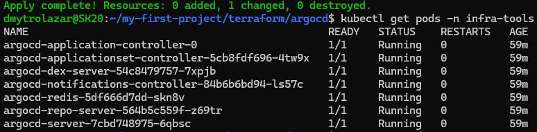
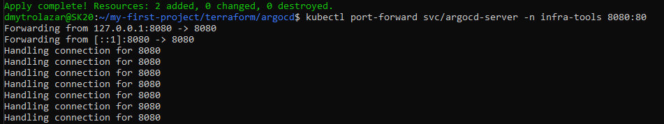
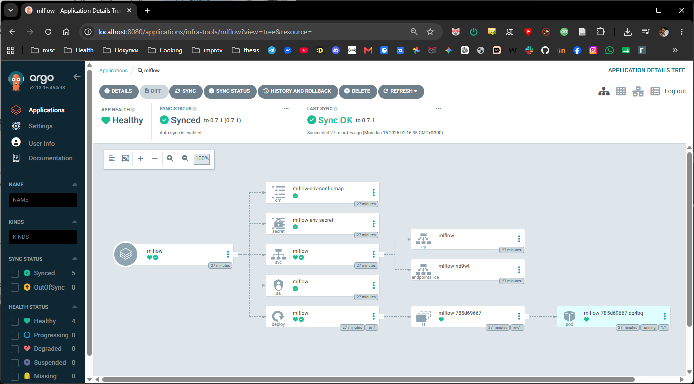
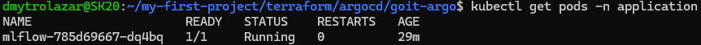
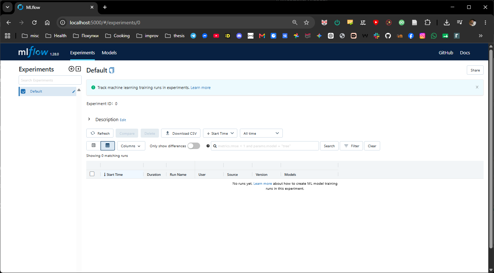

# **GitOps (ArgoCD) Project: MLflow Deployment**

Цей проєкт демонструє налаштування GitOps за допомогою ArgoCD у Kubernetes кластері (EKS) через Terraform та подальше розгортання застосунку MLflow з використанням Helm-маніфестів з Git-репозиторію.

## **🔗 Посилання на Git-репозиторій**

* **Репозиторій з маніфестами GitOps (goit-argo):** https://github.com/dmytrolazar/goit-argo

## **🏗️ Структура проєкту**

* **GitOps (ArgoCD \+ Helm):** Встановлення ArgoCD через Terraform Helm-провайдер та налаштування Application (ApplicationSet) для автоматичного розгортання застосунку MLflow з віддаленого Git-репозиторію.

## **Частина 1: Встановлення ArgoCD через Terraform**

1. Перейдіть до директорії з Terraform конфігурацією ArgoCD (terraform/argocd/):  
   terraform init

2. Оскільки ArgoCD створює власні CRD (наприклад, ApplicationSet), деплой відбувається у два етапи:  
   \# 1\. Встановлення ArgoCD  
   terraform apply \-target=helm\_release.argo \-auto-approve

   \# 2\. Застосування інших ресурсів (ApplicationSet)  
   terraform apply \-auto-approve

3. Перевірте статус Pod-ів у неймспейсі infra-tools:  
   kubectl get pods \-n infra-tools

Скриншот виконання:  

## **Частина 2: Доступ до ArgoCD UI**

1. **Отримайте початковий пароль адміністратора:**  
   kubectl \-n infra-tools get secret argocd-initial-admin-secret \-o jsonpath="{.data.password}" | base64 \-d; echo

   *(Логін за замовчуванням — admin)*  
2. **Відкрийте доступ до веб\-інтерфейсу через Port-Forward:**  
   kubectl port-forward svc/argocd-server \-n infra-tools 8080:443

Скриншот виконання:  

3. Відкрийте браузер за адресою [https://localhost:8080](https://localhost:8080) та увійдіть у систему.

## **Частина 3: Розгортання Application (MLflow) та перевірка результату**

ArgoCD налаштований автоматично відслідковувати Git-репозиторій і застосовувати конфігурацію Helm-чарту MLflow з перевизначеними values.

1. **Перевірка в інтерфейсі ArgoCD:**  
   Додаток mlflow має статус **Healthy** та **Synced**.

Скриншот виконання:  

2. **Перевірка Pod-ів застосунку:**  
   Переконайтеся, що MLflow успішно розгорнувся у цільовому неймспейсі:  
   kubectl get pods \-n application

Скриншот виконання:  

3. **Доступ до UI MLflow:**  
   Щоб відкрити інтерфейс розгорнутого MLflow, прокиньте порт:  
   kubectl port-forward svc/mlflow \-n application 5000:5000

   Відкрийте [http://localhost:5000](http://localhost:5000) у браузері.

Скриншот виконання:  

## **🧹 Очищення ресурсів (Destroy)**

Після завершення тестування обов'язково видаліть ресурси ArgoCD:

\# Видалення ArgoCD та ApplicationSet  
cd terraform/argocd/  
terraform destroy \-auto-approve  
